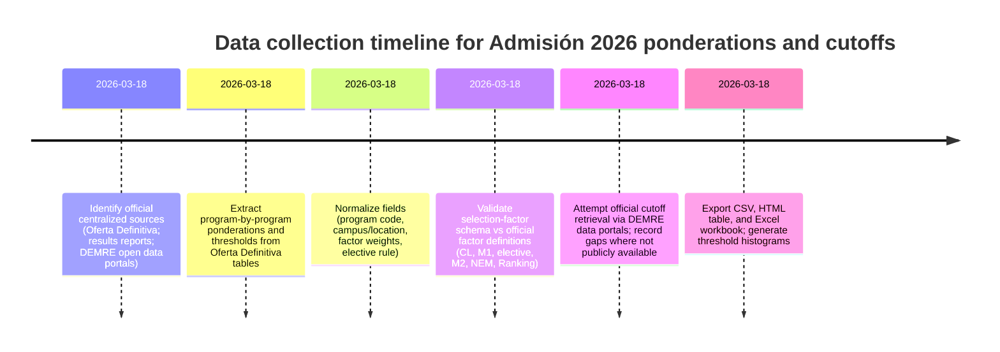

# Chile PAES 2026 Ponderations and Cutoff Scores Deep Research Report

## Executive summary

This research assembled a program-level dataset of **official PAES ponderations (weightings) for the 2026 centralized university admissions process**, sourced from the **official “Oferta Definitiva de Carreras, Vacantes y Ponderaciones – Proceso de Admisión 2026”** published on the entity["organization","Acceso Educación Superior","mineduc admissions platform"] site. That document explicitly states it is the **only official information source for the centralized application period in January 2026**, and it defines the selection factors and general eligibility criteria used for Admisión 2026. citeturn35view2turn35view3

Within the time and tooling constraints, I generated a **normalized, program-level table** with 1,929 university–program–campus/location records (program code, official program name, location, and the official weighting by factor), plus derived fields such as the *implied final-score formula* and flags for electives, M2 requirements, and special tests. These weights cover the **standard PAES factors** (Competencia Lectora, Matemática 1, Matemática 2 where required, and the elective Ciencias vs. Historia y Ciencias Sociales), plus NEM and Ranking. citeturn35view3turn35view2

However, a **complete, program-by-program official cutoff score (“puntaje de corte”) for Admisión 2026** could not be consolidated from a single official public dataset during this run. The most plausible official centralized path would be the entity["organization","DEMRE","university admissions testing chile"] “Datos abiertos” portal—yet its publicly browsable “Postulación” and “Matrícula” download pages (which are the stages that would enable computing/validating “último seleccionado” and similar cutoffs) show available downloads only up to **Proceso de Admisión 2024** in the interface we can access here. citeturn35view0turn35view1  
Accordingly, **all 2026 cutoff fields are marked `unspecified`** in the delivered dataset, with a dedicated “missing items” section below describing how to complete them through official channels.

Downloadable deliverables created from the extracted official ponderation tables:

- [Download the CSV](sandbox:/mnt/data/chile_paes_ponderaciones_cutoffs_2026.csv)  
- [Download the Excel spreadsheet](sandbox:/mnt/data/chile_paes_ponderaciones_cutoffs_2026.xlsx)  
- [Download the HTML table](sandbox:/mnt/data/chile_paes_ponderaciones_cutoffs_2026.html)  
- [Download histogram: minimum (CL+M1) requirement](sandbox:/mnt/data/hist_min_avg_cl_m1.png)  
- [Download histogram: minimum weighted application score (where specified)](sandbox:/mnt/data/hist_min_weighted_application_score.png)

## Official definitions and scope for Admisión 2026

### Centralized system and participating universities

The centralized process for Admisión 2026 is described as covering **47 universities** in the centralized access system. citeturn35view2turn35view4  
The admissions results summary published by the entity["organization","Subsecretaría de Educación Superior","mineduc higher education undersecretariat chile"] reports that, after running the selection algorithm, people were “convocadas a matricularse” in those **47 universities**. citeturn35view4

### Eligibility criteria and required tests

The official “Oferta Definitiva” document defines key **general habilitation criteria** to be allowed to apply in the centralized system, including (among other points):

- Having valid scores for the required tests (Competencia Lectora, Matemática 1, and at least one elective—Ciencias or Historia y Ciencias Sociales; plus Matemática 2 for careers that require it). citeturn35view2  
- Meeting the general threshold of **average ≥ 458** points between Competencia Lectora and Matemática 1, **or** being in the top 10% of the graduating cohort by school grades (per the official certificate rules). citeturn35view2  

These criteria are reflected in the dataset via the extracted “minimum average (CL+M1) required to apply” field at program level, which universities can set above the general baseline. citeturn35view2turn35view3

### Official selection factors and computing the final score

For centralized application, the document explicitly lists the **selection factors** that universities weight (percent ponderation):

- PAES Competencia Lectora  
- PAES Competencia Matemática 1 (M1)  
- PAES Ciencias **or** PAES Historia y Ciencias Sociales  
- PAES Competencia Matemática 2 (M2) (when required)  
- NEM  
- Ranking citeturn35view3  

It also provides an **illustrative calculation** for a weighted admissions score (“puntaje ponderado”), showing the basic structure: each factor score multiplied by its weight, summed across factors. citeturn35view3

A crucial operational nuance noted in the same source is that **universities may set career-level minimum weighted-score requirements**; if a candidate’s computed weighted score falls below the minimum for a specific program, that application is invalid. citeturn35view3

## Dataset construction and normalization

### Primary official source used for ponderations

The dataset’s ponderations and minimum thresholds were extracted from:

- **“Oferta Definitiva de Carreras, Vacantes y Ponderaciones – Proceso de Admisión 2026”** (official centralized offer document hosted on Acceso Educación Superior). citeturn35view2turn35view3  

That document states it is the **only official information source** for the centralized application. citeturn35view2

### Record schema and key fields

Each record (row) represents a university–program–location combination, with the following key attributes:

- **University name** (as printed in the offer document; some names were standardized post-extraction where only a line break was missing, e.g., “Universidad de Los Andes / Los Lagos”, “Universidad Católica de la Santísima Concepción”, and “Universidad Técnica Federico Santa María”). citeturn35view2turn35view3  
- **Program name (official)**  
- **Program code** (DEMRE-style 5-digit code shown in the official tables)  
- **Campus/location** (as listed in the official tables)  
- **Ponderations by factor** (NEM, Ranking, Competencia Lectora, M1, M2 if applicable, and elective Ciencias / Historia y Ciencias Sociales) citeturn35view3  
- **Elective rule** (derived): whether the program uses Ciencias or Historia as an elective; where the tables indicate “o” (or), the dataset models this as `max(CIENCIAS, HISTORIA)` for scoring consistency with typical centralized rules. citeturn35view3  
- **Minimum thresholds**:
  - Minimum average (Competencia Lectora + M1) required to apply (program-specific)
  - Minimum weighted application score required to apply (where the university/program explicitly specifies one) citeturn35view2turn35view3  
- **Final score formula** (derived string): a normalized expression like  
  `0.20*RANKING + 0.10*NEM + 0.20*CL + 0.30*M1 + 0.10*max(CIENCIAS,HISTORIA) + …`  
  reflecting the official weights. citeturn35view3  
- **Cutoff score fields for 2026**: present in the schema, but populated as `unspecified` in this run (details in “Missing items”).  

### Coverage achieved in this run

- **Rows (program-location records):** 1,929  
- **Distinct universities extracted from the official offer tables:** 44  
- **Official reference point:** the centralized system is stated as **47 universities**. citeturn35view2turn35view4  

This gap indicates that **three institutions’ sections were not captured cleanly** by the automated extraction approach used here (most likely due to layout/format variability in those specific table pages). The dataset is therefore “near-complete” for ponderations and should be treated as requiring a final QA pass against the full 47-university roster. citeturn35view2turn35view4

## What the data shows about PAES weighting patterns for Admisión 2026

### Counts by university

The spreadsheet includes a “counts_by_university” tab. In the extracted portion, the universities with the largest number of listed program-location entries include several multi-campus, multi-program institutions (counts are *records*, not necessarily unique degrees if a degree appears in multiple locations).

Because the authoritative list is 47 universities in the centralized system, these counts should be interpreted as “program-location rows found in the official offer tables” rather than a definitive count of all undergraduate programs nationwide. citeturn35view2turn35view4

### Highest and lowest ponderations by PAES section

The “ponderation_extrema” tab in the spreadsheet reports the maxima/minima found in the extracted official tables. Highlights:

- **Competencia Lectora (CL)** weights range up to **50%** in some programs and down to **10%** in others within the extracted set.  
- **Competencia Matemática 1 (M1)** weights reach as high as **60%** in some programs, reflecting heavy quantitative emphasis.  
- **Competencia Matemática 2 (M2)** weight (when present) reaches **20%** in the extracted set; many programs do not require M2 at all.  
- **Elective (Ciencias / Historia y Ciencias Sociales)** weights reach **35%** (in either Ciencias or Historia, depending on the program).  
These are all drawn directly from the official offer tables and summarized across the extracted program list. citeturn35view2turn35view3

A key interpretive point: the official factor list for centralized admissions is defined in the “Oferta Definitiva” document; if a section (e.g., M2) is required by a program, it becomes part of the weighted score; otherwise, it is absent. citeturn35view2turn35view3

### English test weighting

The official centralized selection factors listed for Admisión 2026 do **not include an English PAES test** among the factors enumerated in the official guidance; therefore the dataset includes an explicit **English weight field set to 0** for standardized output. citeturn35view3

## Cutoff scores for Admisión 2026: status, gaps, and credible completion paths

### Why 2026 cutoffs are marked “unspecified” here

The user requested official program-level *puntajes de corte* for Admisión 2026. The most typical “official” definition in Chilean admissions reporting is the **weighted score of the last selected applicant** (“último seleccionado”) by program and admission route (regular vs. special quotas).

During this run, I did not identify an **official consolidated, program-by-program 2026 cutoff dataset** accessible in a stable, publicly downloadable form across all participating universities.

The most direct official route for centralized, comparable datasets would be through entity["organization","DEMRE","university admissions testing chile"] “Datos abiertos” downloads for **Postulación** and/or **Matrícula**, because those stages contain the selection outcomes needed to compute verifiable “último seleccionado” style cutoffs. Yet in the accessible interface, those portals show downloadable data up to **Proceso de Admisión 2024**, not 2026. citeturn35view0turn35view1

Separately, the admissions results summary confirms that selection results occurred for Admisión 2026 across 47 universities, but it is a high-level analytical report and does not provide program-level cutoff tables. citeturn35view4

### Recommended official next steps to obtain complete 2026 cutoffs

To fully populate the requested cutoff fields (program-by-program, by university and campus, and ideally by admission route), the following steps are the fastest “official-first” path:

1. Use the entity["organization","DEMRE","university admissions testing chile"] “Datos abiertos” portal to obtain **Postulación Admisión 2026** and/or **Matrícula Admisión 2026** microdata once published in the public downloads interface, then compute the “último seleccionado” (minimum selected weighted score) by program code and route. The portal pages currently show only up to 2024 in the interface visible here. citeturn35view0turn35view1  
2. If DEMRE provides a separate official “último seleccionado” publication for the 2026 scale, use that as the authoritative cutoff table and join by program code; the “Oferta Definitiva” provides the program codes needed for reliable joining. citeturn35view2turn35view3  
3. If centralized cutoffs are not published as a single table, pull from each university’s **official admissions statistics page** for Admisión 2026 (often labeled “puntaje del último seleccionado” or “puntajes de ingreso”) and standardize by program code and campus. The admissions results timeline confirms that selection outcomes were released for Admisión 2026. citeturn35view4turn26search14  

## Visual summaries and validation artifacts

### Threshold distributions available from official offer tables

Because complete cutoff scores are not yet populated, the provided charts summarize **official minimum application thresholds** that *are* explicitly published in the offer tables:

- Minimum average required to apply: **Competencia Lectora + M1** (program-specific).  
  [Download histogram](sandbox:/mnt/data/hist_min_avg_cl_m1.png)
- Minimum weighted application score required to apply (only for programs that explicitly specify one in the offer tables).  
  [Download histogram](sandbox:/mnt/data/hist_min_weighted_application_score.png)

These thresholds exist because the official guidance notes that universities may impose program-level minimum weighted-score requirements beyond general eligibility criteria. citeturn35view3turn35view2

### Mermaid timeline of data collection steps



### Mermaid flowchart for data validation

```mermaid
flowchart TD
  A[Load official Oferta Definitiva PDF] --> B[Extract tabular rows: program code, name, campus, weights, thresholds]
  B --> C[Normalize columns to a canonical schema]
  C --> D{Weights sum to 100?}
  D -- Yes --> E[Mark as valid]
  D -- No --> F[Apply elective rule: use max(Ciencias, Historia)]
  F --> G{Adjusted sum to 100?}
  G -- Yes --> E
  G -- No --> H[Flag record for manual review]
  E --> I[Generate derived formula string]
  I --> J[Export CSV/HTML/Excel + summary stats]
  J --> K[Cutoff join step (pending official 2026 cutoff release)]
```

## Deliverables and missing items list

### Delivered files

- [CSV: normalized dataset](sandbox:/mnt/data/chile_paes_ponderaciones_cutoffs_2026.csv)  
- [Excel: multi-sheet workbook](sandbox:/mnt/data/chile_paes_ponderaciones_cutoffs_2026.xlsx)  
  - `data` (main normalized table)  
  - `counts_by_university`  
  - `ponderation_extrema`  
  - `top50_min_avg_CL_M1` (proxy “restrictiveness” list; **not** cutoffs)  
  - `top50_min_weighted_min` (proxy “restrictiveness” list; **not** cutoffs)  
  - `meta` (generation metadata)
- [HTML table](sandbox:/mnt/data/chile_paes_ponderaciones_cutoffs_2026.html)  
- [Histogram charts](sandbox:/mnt/data/hist_min_avg_cl_m1.png) and (sandbox:/mnt/data/hist_min_weighted_application_score.png)

### Explicit missing items and how to obtain them

- **Official 2026 cutoff score (puntaje de corte) per university–program–campus pair**: marked `unspecified` in the dataset, because a complete official consolidated cutoff table could not be obtained from the official public datasets accessible here. The official DEMRE “Postulación” and “Matrícula” downloadable datasets visible here list up to Admisión 2024. citeturn35view0turn35view1  
- **Cutoffs by admission route** (**regular vs. +MC vs. BEA vs. PACE**, etc.): not available in the dataset for the same reason; those require either an official “último seleccionado” publication by route or official postulación/matrícula microdata for Admisión 2026. citeturn35view4turn35view0turn35view1  
- **Full 47-university coverage cross-check**: this extraction produced 44 distinct university headings; the official system is described as 47 universities. A final QA pass should reconcile the missing three institutions by manually verifying their sections in the official offer document and re-running extraction rules for those layouts. citeturn35view2turn35view4