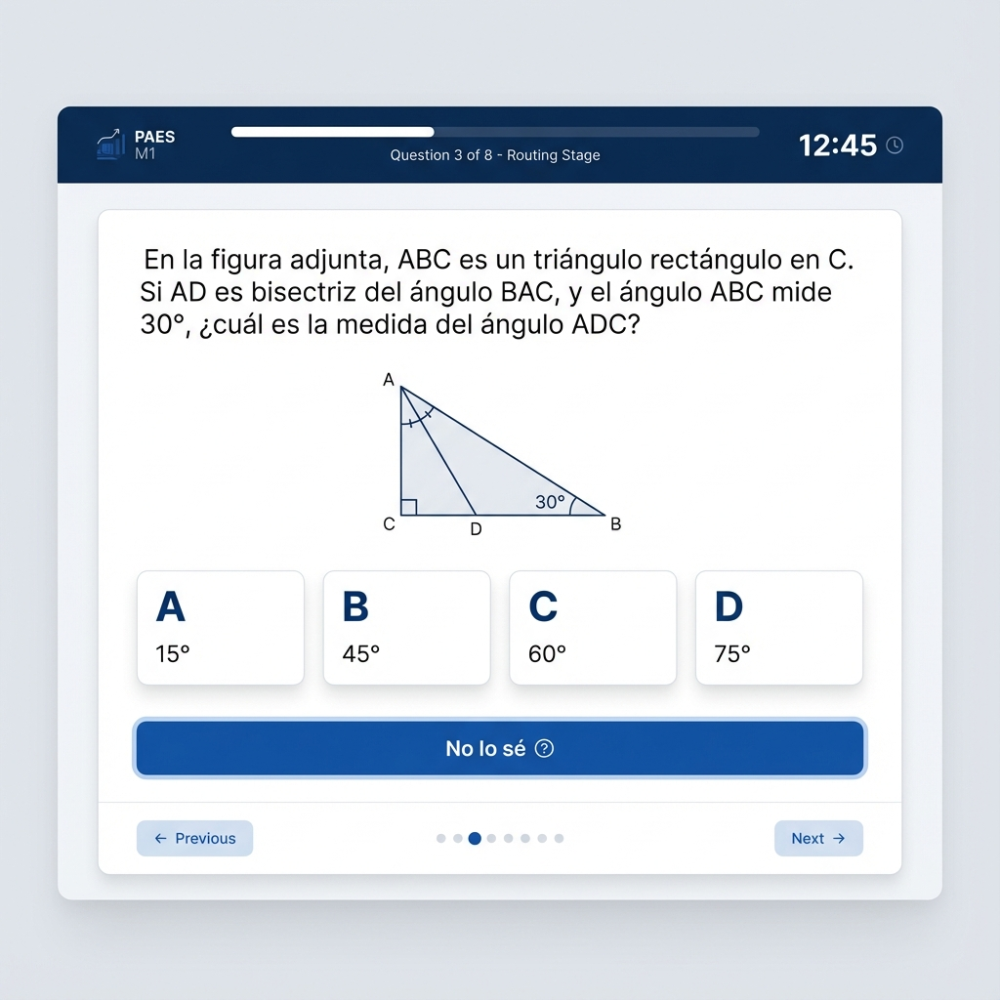
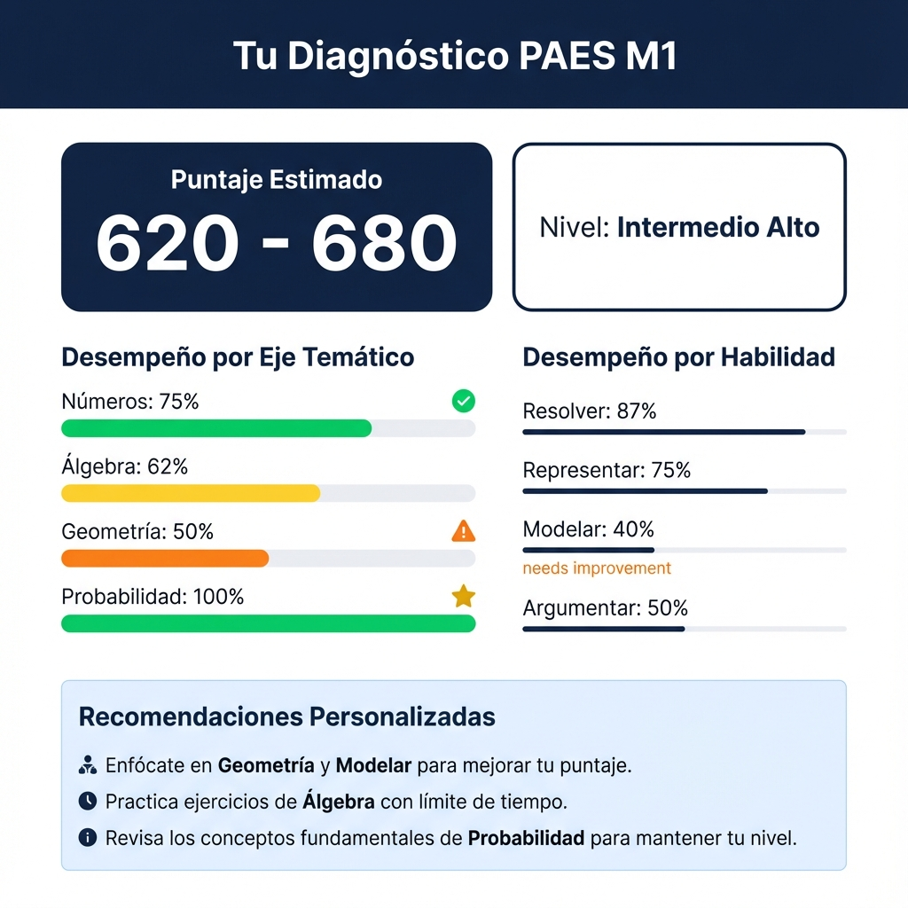

# Diseño UI: Prueba Diagnóstica PAES M1

**Fecha:** 2026-01-08  
**Estado:** Diseño inicial

---

## 1. Pantallas del Flujo

### 1.1 Pantalla de Pregunta



**Elementos:**

| Componente | Descripción |
|------------|-------------|
| **Header** | Logo PAES, progreso "Pregunta X de 8", indicador de etapa |
| **Timer** | Tiempo restante (opcional) |
| **Pregunta** | Texto + figura/ecuación si aplica |
| **Opciones** | 4 cards (A, B, C, D) clickeables |
| **No lo sé** | Botón prominente debajo de opciones |
| **Navegación** | Previous/Next (si permitido) |

**Comportamiento:**
- Al seleccionar opción → resaltar y habilitar "Next"
- Click en "No lo sé" → registrar como `dont_know`
- No permitir "Previous" en MST (decisión irrevocable)

---

### 1.2 Transición entre Etapas

**Después de R1 (pregunta 8):**

```
┌─────────────────────────────────────────┐
│                                         │
│   ✅ Etapa 1 Completada                 │
│                                         │
│   Hemos calibrado tu nivel.             │
│   Ahora verás 8 preguntas               │
│   adaptadas a ti.                       │
│                                         │
│        [ Continuar → ]                  │
│                                         │
└─────────────────────────────────────────┘
```

---

### 1.3 Pantalla de Resultados



**Secciones:**

1. **Puntaje PAES estimado:** Rango grande y visible
2. **Nivel:** Badge con color (verde/amarillo/naranja)
3. **Diagnóstico por Eje:** Barras horizontales con %
4. **Diagnóstico por Habilidad:** Lista con indicadores
5. **Recomendaciones:** Tips personalizados

---

## 2. Flujo de Navegación

```
[Inicio]
    ↓
[R1: Preguntas 1-8] ← Timer opcional
    ↓
[Pantalla de transición]
    ↓
[Etapa 2: Preguntas 9-16] ← Ruta A/B/C según R1
    ↓
[Pantalla de resultados]
    ↓
[Plan de estudio] (opcional)
```

---

## 3. Paleta de Colores

| Elemento | Color | Hex |
|----------|-------|-----|
| Primary | Azul oscuro | #1a365d |
| Success | Verde | #38a169 |
| Warning | Naranja | #dd6b20 |
| Danger | Rojo | #e53e3e |
| Background | Gris claro | #f7fafc |
| Cards | Blanco | #ffffff |

---

## 4. Especificaciones Técnicas

### Rutas de preguntas

```
app/data/pruebas/finalizadas/<examen>/qti/<ID>/
├── question.html    ← Renderizar esto
├── question.xml     ← Backup
└── metadata_tags.json
```

### Integración con módulo

```python
from app.diagnostico import MSTEngine

# Iniciar prueba
engine = MSTEngine()
questions = engine.get_routing_questions()

# Obtener HTML de cada pregunta
for q in questions:
    html_path = f"{q.full_path}/question.html"
```

---

## 5. Próximos Pasos

- [ ] Implementar componentes React/Vue/HTML
- [ ] Conectar con módulo `app/diagnostico`
- [ ] Agregar lógica de timer (opcional)
- [ ] Implementar pantalla de transición
- [ ] Implementar pantalla de resultados
